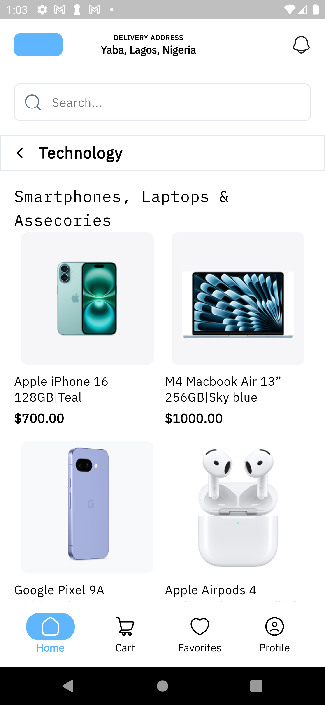
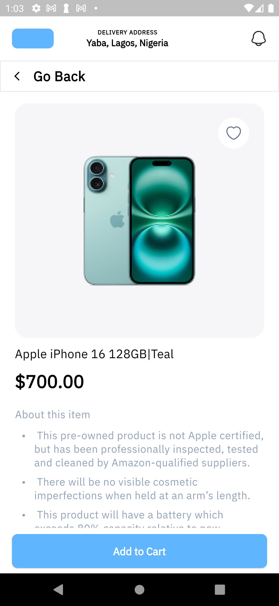
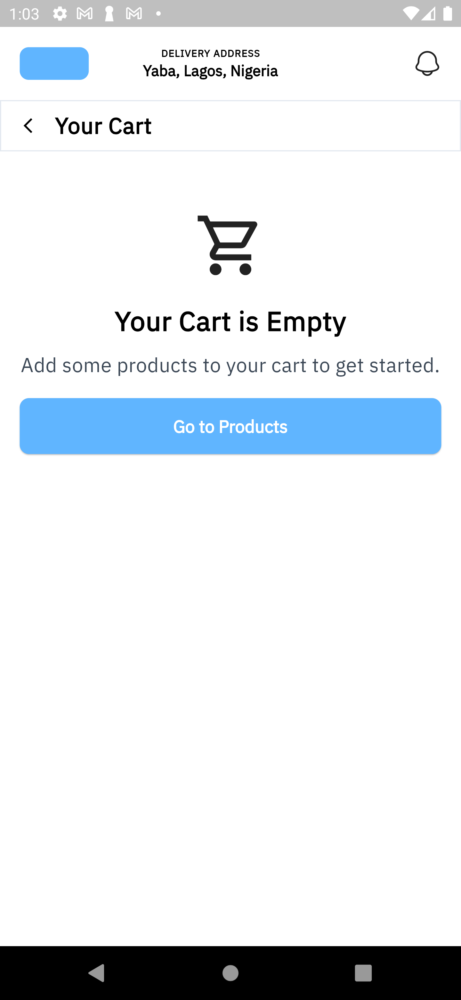
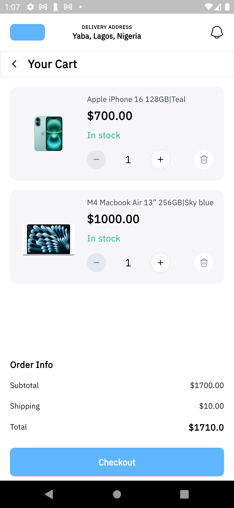
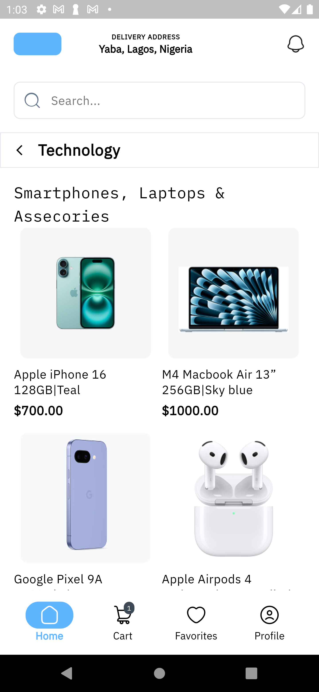
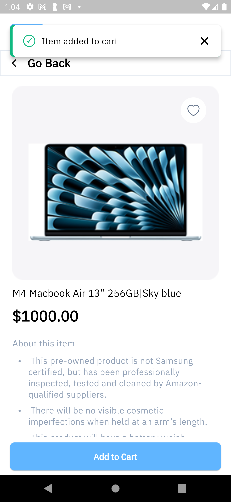

# MiniMart  ---  AlphaTwelve Flutter Developer Task


## Framework

This project is built using **Flutter**, an open-source UI software development toolkit created by Google. Flutter allows for the development of high-performance, natively compiled applications for mobile, web, and desktop from a single codebase. It offers a fast development cycle with hot reload, expressive and flexible UI components, and a rich ecosystem of packages.


## 📦 Project Structure Overview

The app follows a **feature-first modular architecture**, keeping features independent and scalable. Here's a quick look:

```
ALPHA_TWELVE/
├── android/                  # Android config
├── ios/                      # iOS config
├── assets/                   # Images, vectors, mock data
│   ├── images/
│   ├── vectors/
│   └── products.json
├── fonts/                    # Custom fonts
├── lib/
│   ├── gen/                  # Auto-generated files
│   └── src/
│       ├── app/              # Global constants & setup
│       ├── features/         # Modular features (cart, home, profile, etc.)
│       │   ├── cart/
│       │   │   ├── application/       # ViewModel & UI state
│       │   │   ├── models/            # DTOs and models
│       │   │   └── presentation/      # UI components
│       │   ├── home/
│       │   ├── product/
│       │   └── splash/
│       └── routing/                   # GoRouter config
└── pubspec.yaml              # Dependencies and metadata
```

## 🚀 Getting Started

1. Make sure Flutter and Dart are installed
2. Run:

   ```bash
   flutter pub get
   flutter run
   ```

## 🧠 Architecture Highlights

Each feature is organized into:

* `application/`: ViewModels and UI logic (with Riverpod)
* `models/`: DTOs and core models
* `presentation/`: UI widgets using Google Fonts & clean theming

## 🔁 State Management: Riverpod

* Uses `AsyncNotifier`, `Provider`, and `StateNotifier`
* Decoupled logic from `BuildContext`
* Improves testability and readability

## 🔀 Navigation: GoRouter

* Named routes defined in `routing/`
* Cleaner and more scalable than Navigator 1.0

## 🖋️ Typography & Styling

* `google_fonts` for a modern UI feel
* Centralized theming via:

  * `typography.dart` for text styles
  * `alpha_colors.dart` for consistent color use
  * `constants.dart` for spacing, durations, etc.

## 📁 Assets

Defined in `pubspec.yaml`:

* PNGs, SVGs, and `products.json`
* `ScreenUtil` is used for responsive sizing

## 🔔 Icons

* Notification icons and others from `HugeIcons` package

## ✅ Completed Tasks Summary

### 🏠 Home / Product Listing

* Scrollable product grid
* Each card shows image, title, and price
* Tap navigates to details page (via GoRouter)

### 🛍 Product Details

* Image, name, price, description
* Add to Cart button triggers toast + updates cart badge

### 🛒 Cart

* Lists added products with quantity controls
* Increment, decrement, and remove support

### 📱 Bottom Navigation

* Includes cart with real-time badge updates

### 🧭 Flow Covered

Home → Product → Add to Cart → Toast + Cart Counter → Cart View

---

## 📋 Final Notes

This codebase is designed to be scalable and clean:

* Feature-based separation
* No `BuildContext` in business logic
* Reusable styling and assets
* Responsive layout practices

## Screenshots

### Home


### Product Page


### Cart (Empty)


### Cart with Items


### Cart Count Badge


### Popup Display

